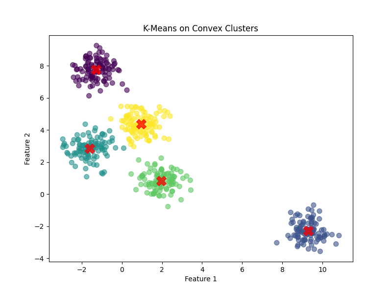
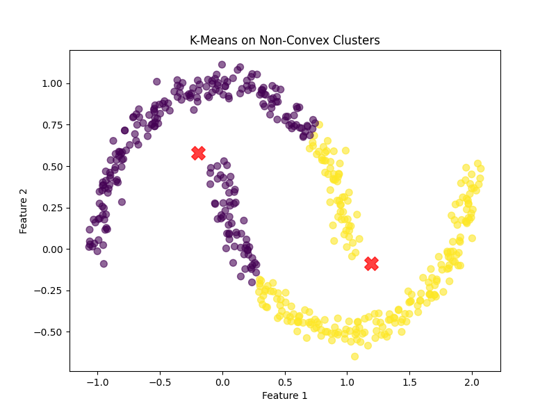
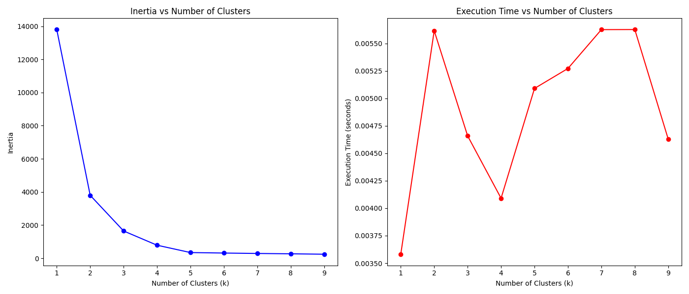
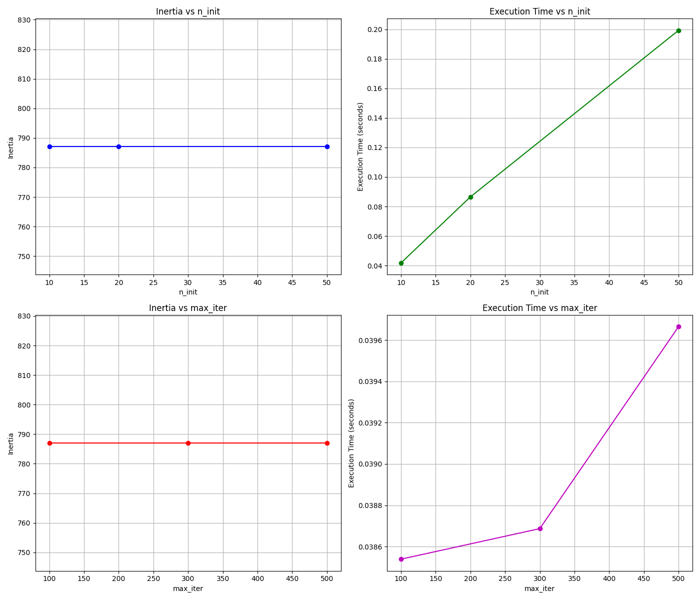

 # SUMMARY
 As we can see on the first photo k-means method perfectly works
 for Convex clusters.
 

 But if we use the moon method for creating Non_Convex clusters, 
 there will be a problem defining for which cluster a dot belongs,
 because k-means tries to minimize the distance to the center of the
 cluster and do not count the form of the cluster.
 
 
 Inertia depends on the number od cluster, what seems to be a y=1/k function.
 But execution time here doesn't seem to be affected.
 

 The n_init and max_iter parameters should give more accurate results by using more time.
 