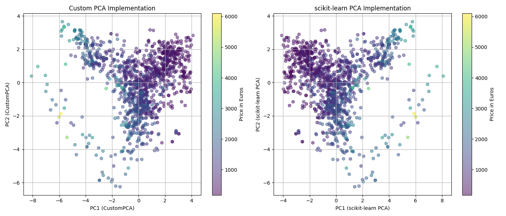
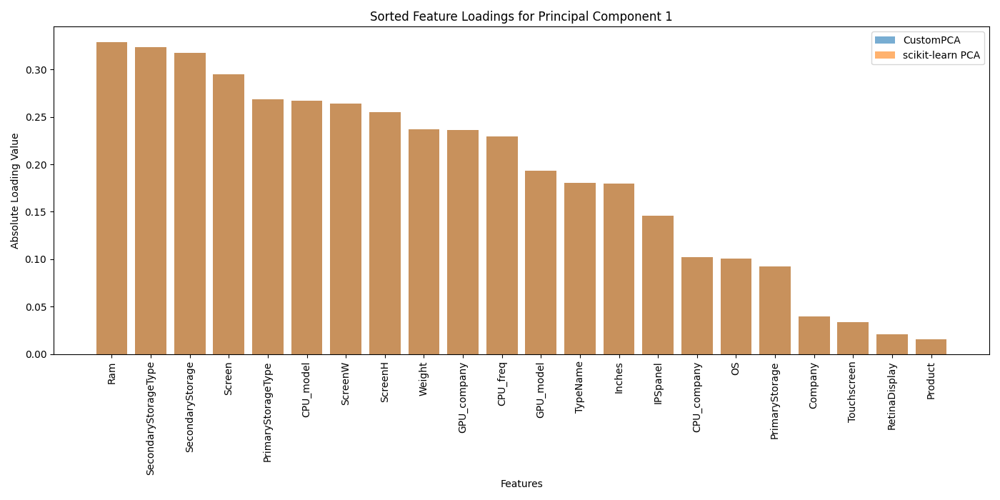
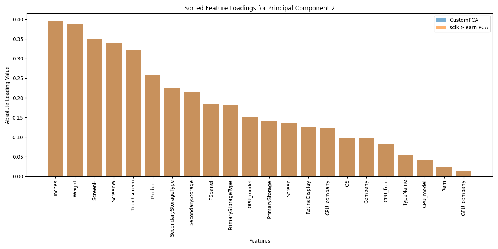

 # SUMMARY
 I didn’t fully understand what I needed to understand from the operation of this algorithm,
 but as the graph shows, I got almost the same results as the built-in PCA.
 The only difference is the horizontal flipping,
 which may indicate that the built-in PCA calculates the eigenvectors of the covariance matrix differently.
 + You can see which parts have a greater influence on the price of laptops.

Here is graphs, so u don't need to run this program:

