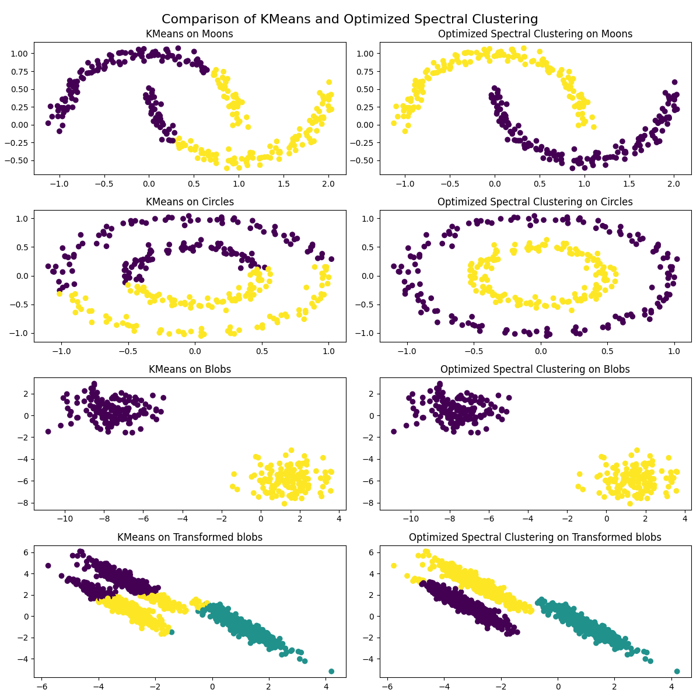

# Spectral clustering vs K-means

## Results of program:

Let's talk about the differences with two methods of clusterization.

### K-means:
- Finding centroids:
  * the first centroid is selected randomly from the data
  * for each subsequent centroid, a point in the data is selected with a probability proportional to the square of the distance to the nearest centroid among several candidates chosen at random
  * this process is repeated until the specified number of centroids is selected
- Clusterization:
  * the square of the Euclidean distance from each observation to the centroids is then calculated
  * based on the distance obtained, the observations are labeled with the clusters that are closest to them, and inertia, a measure of how well the data have been clustered, is calculated
  * steps 2-3 are repeated until the inertia in the current and previous iterations stops changing less than a set threshold
  * the observations closest to the obtained centroids will constitute clusters
#### Pros:
  * Easy to recreate and understand
  * High speed
  * Very efficient on blob clusters

#### Cons:
  * Not efficient when clusters have not-blob shape
  * Sensitivity to outliers (means the data points that significantly different from other data points)

### Spectral clusterization:
It's important to mention that Spectral clusterization also uses K-means inside it's realization, but for changed data by finding
eigen vectors and values in Laplacian matrix.
Cause of that this algorithm is more time-consuming.
I used the nearest_neighbor matrix finding method for this task.
- Algorithm:
  * a graph is created where each node is a data point, and edges are established between nodes based on similarity
  * the graph's Laplacian matrix is calculated, which represents the structure of the data
  * eigenvalues and eigenvectors of the Laplacian matrix are computed. The data points are then embedded in a lower-dimensional space based on these eigenvectors
  * K-means is applied to this lower-dimensional representation to create clusters
#### Pros:
* Can capture complex, non-convex clusters that K-means alone cannot handle
* Ability to process multidimensional data due to dimensionality reduction before clustering

#### Cons:
* Large datasets can take more time to compute due to eigen decomposition
* Sensitive to the choice of similarity graph and the number of neighbors, which can impact clustering quality
  (as when I used rbf method for finding matrix it was almost the same as k-means)

### Overall:
K-means best for blob shaped clusters and large datasets cause of its simplicity,
when spectral clusterization can work with more irregular shapes like non-convex clusters.