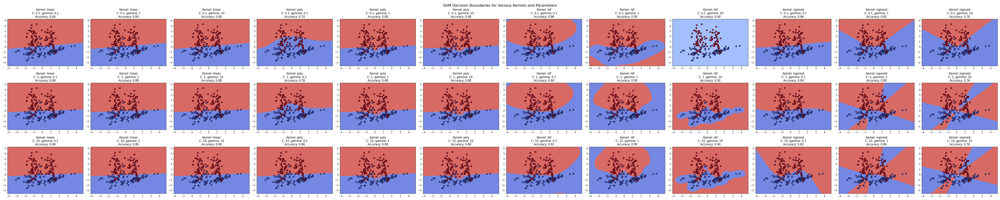
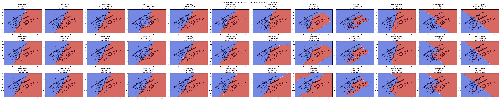
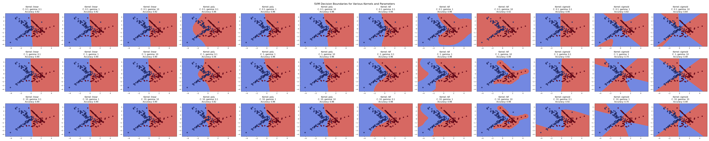
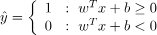
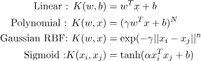

# Results of program

_(I hope u can see them by zooming, if not png files are in root folder of project)_

So, SVM is a machine learning algorithm used for classification and regression task (totally not a wiki sentence).
To be simple our main goal is to find so-called hyperplane that will classify a set of features.

To achieve this we can use a set of parameters:

* C (Regularization Parameter)
  *  balances margin maximization and the penalty for misclassifications. A higher C value imposes a stricter penalty
  for margin violations, leading to a smaller margin but fewer misclassifications.
  (where margin is the distance between the closest points to hyperplane)
* Gamma (Kernel Coefficient)
  * defines the influence of individual training samples. A low gamma value implies that far-reaching points
  have a significant impact on the decision boundary, leading to smoother boundaries. Vice-versa for high value
* **Kernel** function (obviously the main param)
  * transform the input feature space into higher-dimensional spaces, enabling SVM to handle non-linearly
  separable data by finding linear separators in these transformed spaces. Basically a fucntion that defines how will
  the shape of out hyperplane look-like.

There are 4 kernel function that I used in this task:
* Linear
* Polynomial
* Radial Basis Function (RBF)
* Sigmoid

Linear equation: 

where x and y are corresponding data, the w is the perpendicular vector to hyperplane and b is offset from the origin.
The simplest one, which will find a straight line between two sets.

Other functions: 

As us can see on each of my plots, different functions give us different patterns of hyperplane.

Polynomial give a little bit of curves to plane.

RBF using Gaussian function measures the similarity based on the distance.
It is very sensitive to params, so the higher gamma and c params the stricter will be the pattern of hyperplane.

Sigmoid uses the tan function to achieve S-shaped hyperplanes.
But to high gamma values breaks the function, which leads to not accurate results.

Overall it is a great algorithm to separate data in machine learning, but can be slow on large datasets.
For example this 200 points dataset on 36 scenarios takes roughly ~25 seconds (maybe on better machine it will be faster)
This is not a huge dataset, but still takes a lot of time. 
Also, one of the biggest advantages is the possibility to ignore the data in wrong set (thanks to margin).
But it can be hard to know exactly which params will lead to the best results.
